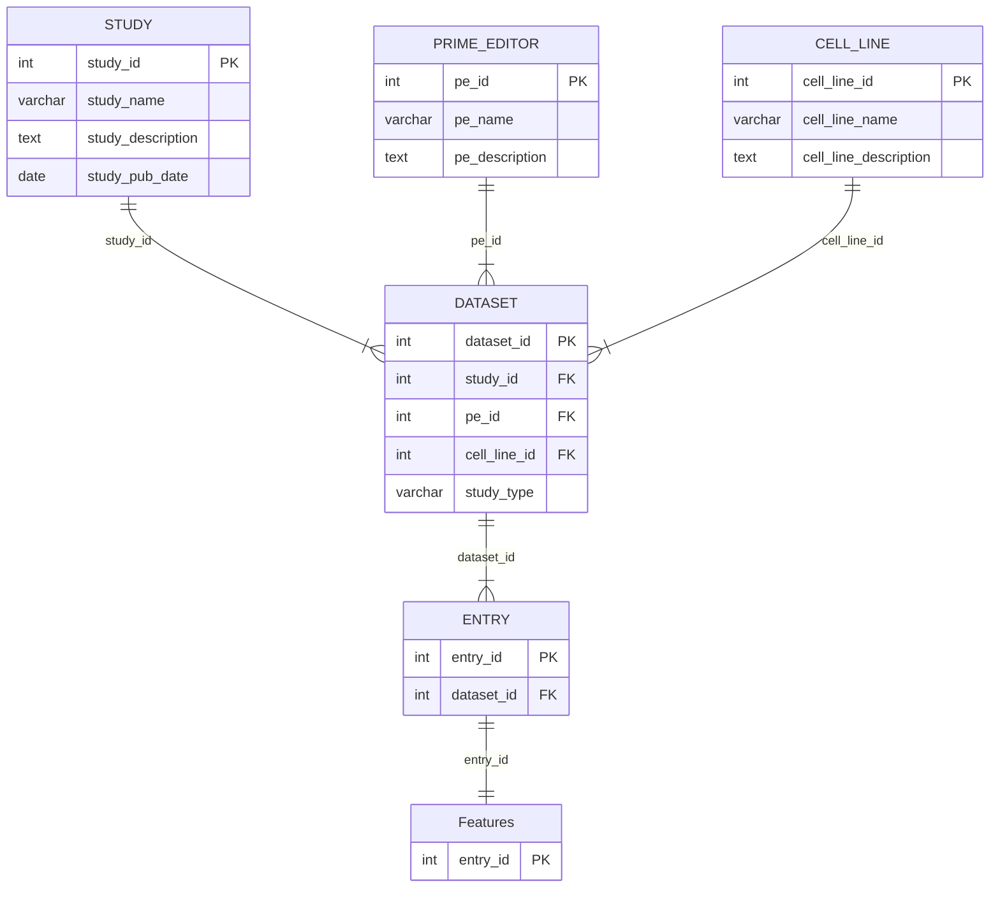

```mermaid
erDiagram
    STUDY {
      int study_id PK
      varchar study_name
      text study_description
      date study_pub_date
    }

    CELL_LINE {
      int cell_line_id PK
      varchar cell_line_name
      text cell_line_description
    }

    PRIME_EDITOR {
      int pe_id PK
      varchar pe_name
      text pe_description
    }

    DATASET {
      int dataset_id PK
      int study_id FK
      int pe_id FK
      int cell_line_id FK
      varchar study_type
    }

    ENTRY {
      int entry_id PK
      int dataset_id FK
    }

    Features {
      int entry_id PK
      
    }

    STUDY ||--}| DATASET : "study_id"
    PRIME_EDITOR ||--}| DATASET : "pe_id"
    CELL_LINE ||--}| DATASET : "cell_line_id"
    DATASET ||--}| ENTRY : "dataset_id"
    ENTRY ||--|| Features: "entry_id"
```